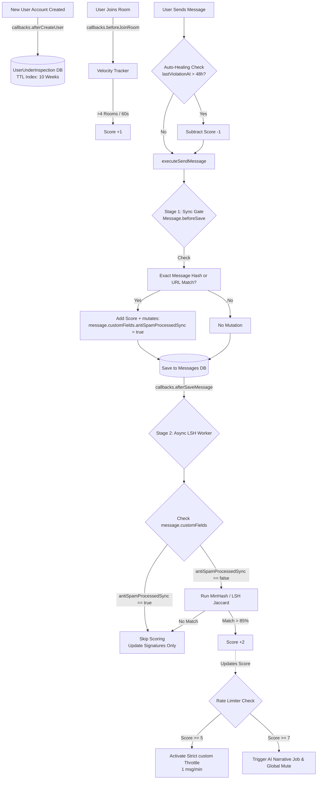

```mermaid
graph TD
    %% User Lifecycle
    A[New User Account Created] -->|callbacks.afterCreateUser| B[(UserUnderInspection DB<br>TTL Index: 10 Weeks)]
    
    %% Room Join Lifecycle
    J1[User Joins Room] -->|callbacks.beforeJoinRoom| J2[Velocity Tracker]
    J2 -- >4 Rooms / 60s --> J3[Score +1]
    
    %% Message Lifecycle
    C[User Sends Message] --> D{Auto-Healing Check<br>lastViolationAt > 48h?}
    D -- Yes --> D1[Subtract Score -1]
    D -- No --> D2
    D1 --> D2[executeSendMessage]
    
    D2 --> E{Stage 1: Sync Gate<br>Message.beforeSave}
    
    E -->|Check| F[Exact Message Hash or URL Match?]
    F -- Yes --> G[Add Score + mutates:<br>message.customFields.antiSpamProcessedSync = true]
    F -- No --> H[No Mutation]
    
    G --> I[(Save to Messages DB)]
    H --> I
    
    I -->|callbacks.afterSaveMessage| J{Stage 2: Async LSH Worker}
    
    J --> K{Check message.customFields}
    K -- antiSpamProcessedSync == true --> L[Skip Scoring <br> Update Signatures Only]
    K -- antiSpamProcessedSync == false --> M[Run MinHash / LSH Jaccard]
    
    M -- Match > 85% --> N[Score +2]
    M -- No Match --> L
    
    %% Enforcement & AI Pipeline
    N -. Updates Score .-> RL{Rate Limiter Check}
    RL -- Score >= 5 --> RM[Activate Strict custom Throttle<br>1 msg/min]
    RL -- Score >= 7 --> O[Trigger AI Narrative Job & Global Mute]
```

---
